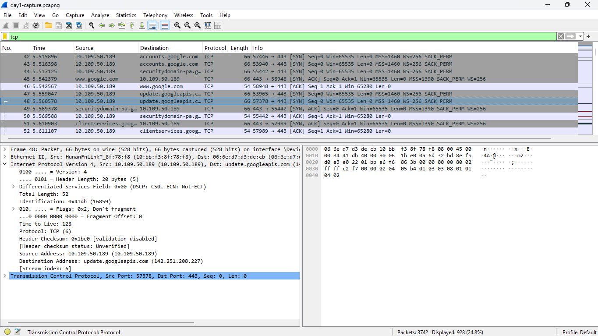

# 📘 Network Engineering Progress Log
**Started:** February 2026
**Engineer:** [Your Name]
**Goal:** CCNA → CCNP → International Network Engineer

---

## 📅 WEEK 1 — Networking Fundamentals

### Day 1 — February 23, 2026
**Topics Covered:**
- OSI Model
- Wireshark Introduction

**What I Learned:**
- **DNS Packet:**
  - DNS server IP found: 81.50.109.10
  - Layer 4 protocol used: UDP
  - Port number: 53
- **TCP Handshake:**
  - Found it: Yes
  - Observations:
    - SYN → Client says "I want to connect, here is my sequence number"
    - SYN-ACK → Server says "Accepted. I acknowledge your sequence, here is mine"
    - ACK → Client says "Acknowledged. Connection established."
- **ICMP:**
  - Found it: No
  - Reason: No pinging occurred during the session

**Mistakes I Made & Corrections:**
- PDU at Layer 3 is PACKET not Segment ✅ corrected

**Lab Completed:** ✅ Wireshark capture — day1-capture.pcapng



**Score:** 8/10

**DNS Server Found:** 81.50.109.10

---

### Day 2 — [Date]
**Topics Covered:**
-

**What I Learned:**
-

**Mistakes I Made & Corrections:**
-

**Lab Completed:**

**Score:**

---
```

---

