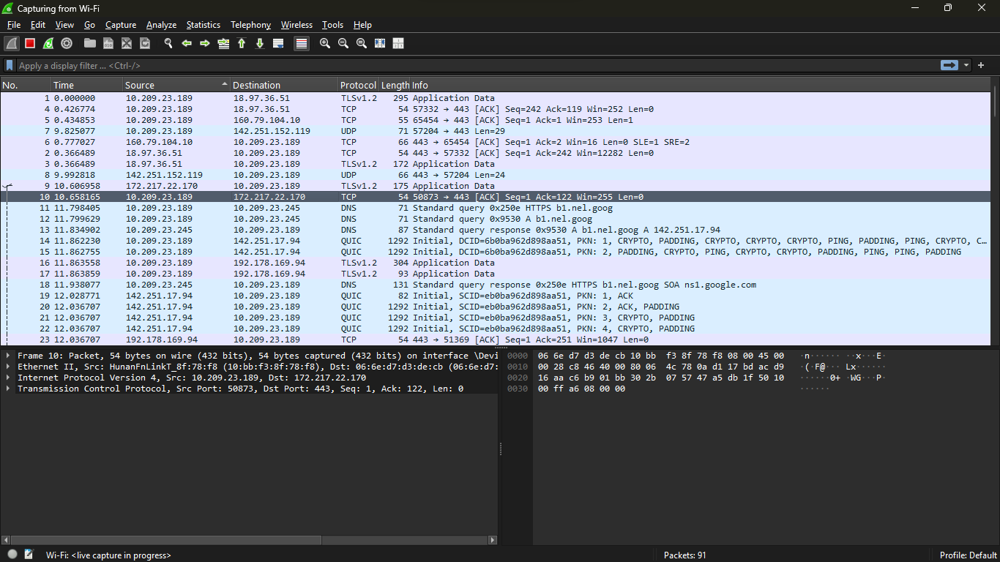

<!-- markdownlint-disable-file -->
# Week 2 — TCP/IP Model + 10 Key Protocols + Wireshark

**Phase:** 1 — Foundations  
**Date:** 21 March 2026  
**Status:** ✅ Complete

---

## The TCP/IP Model

The TCP/IP model is the real-world model the internet actually runs on. It has 4 layers compared to the OSI model's 7 layers.

| TCP/IP Layer | OSI Layers Covered |
|---|---|
| Application | OSI Layers 7, 6, 5 — Application, Presentation, Session |
| Transport | OSI Layer 4 — Transport |
| Internet | OSI Layer 3 — Network |
| Network Access | OSI Layers 2, 1 — Data Link, Physical |

---

## OSI vs TCP/IP

| OSI Model | TCP/IP Model |
|-----------|-------------|
| 7 layers | 4 layers |
| Theoretical reference model | Real-world practical model |
| Used for teaching and understanding | Used to build the internet |

---

## The 10 Key Protocols

| Protocol | Port | Layer | Job |
|----------|------|-------|-----|
| DNS | 53 | Application | Translates domain names to IP addresses |
| DHCP | 67/68 | Application | Auto-assigns IP addresses to devices |
| HTTP | 80 | Application | Transfers web pages — no encryption |
| HTTPS | 443 | Application | Transfers web pages — encrypted with TLS/SSL |
| FTP | 20/21 | Application | Transfers files between client and server |
| SMTP | 25 | Application | Sends emails |
| TCP | — | Transport | Reliable, connection-oriented delivery |
| UDP | — | Transport | Fast, connectionless delivery |
| ICMP | — | Network | Network diagnostics — ping |
| ARP | — | Data Link | Resolves IP addresses to MAC addresses |

---

## Protocol Details

### DNS — Domain Name System (Port 53)
Translates human-readable domain names into IP addresses.  
Example: `www.ug.edu.gh` → `197.255.125.2`  
Uses UDP. Sometimes TCP for large queries.

### DHCP — Dynamic Host Configuration Protocol (Port 67/68)
Automatically assigns network configuration to devices when they join a network.  
Assigns: IP address, Subnet mask, Default gateway, DNS server.  
Port 67 = server. Port 68 = client.

### HTTP — Hypertext Transfer Protocol (Port 80)
Transfers web pages from server to browser.  
Sends data in plain text — no encryption. Unsafe for sensitive data.

### HTTPS — Hypertext Transfer Protocol Secure (Port 443)
Same as HTTP but encrypts data using TLS/SSL.  
Always use HTTPS for banking, login pages and sensitive data.

### FTP — File Transfer Protocol (Port 20/21)
Transfers files between a client and a server.  
Port 21 = control connection. Port 20 = data transfer.  
Sends data in plain text — SFTP (Port 22) is the secure version.

### SMTP — Simple Mail Transfer Protocol (Port 25)
Sends emails from client to mail server.  
SMTP only sends — it does not receive.  
POP3 (Port 110) and IMAP (Port 143) handle receiving.

### TCP — Transmission Control Protocol
Reliable, connection-oriented delivery.  
Uses a 3-way handshake before data flows: SYN → SYN-ACK → ACK.  
Retransmits lost segments. Used for web, email, file transfers.

### UDP — User Datagram Protocol
Fast, connectionless delivery. No handshake. No retransmission.  
Used for video calls, streaming, gaming, DNS.

### ICMP — Internet Control Message Protocol
Used for network diagnostics and error reporting.  
The `ping` command uses ICMP to test if a host is reachable.  
Operates at Layer 3 — no port number.

### ARP — Address Resolution Protocol
Resolves an IP address into a MAC address on the same local network.  
Broadcasts "Who has this IP?" to all devices → target replies with MAC.  
View ARP table with: `arp -a`

---

## TCP vs UDP Comparison

| Feature | TCP | UDP |
|---------|-----|-----|
| Connection | 3-way handshake | No handshake |
| Reliability | Guaranteed delivery | No guarantee |
| Speed | Slower | Faster |
| Retransmission | Yes | No |
| Use cases | Web, email, file transfer | Video calls, streaming, gaming |

---

## TCP 3-Way Handshake

1. **SYN** — Client says "I want to connect"
2. **SYN-ACK** — Server replies "I accept, are you ready?"
3. **ACK** — Client confirms "Yes, I am ready"

Data flows only after all 3 steps are complete.

---

## Wireshark — Week 2 Exercise

1. Open Wireshark → select Wi-Fi adapter → start capture
2. Open browser → visit `http://example.com`
3. Stop capture
4. Filter `dns` → find DNS query → note the IP returned
5. Filter `tcp` → find a SYN packet → note the source and destination
6. Filter `arp` → find an ARP request → note the IP being resolved

---

## Resources Used
- Kurose & Ross — Chapter 1 §1.4, 1.6 + Chapter 2 §2.1
- Odom CCNA Guide — Chapter 2
- Professor Messer — Network Protocols (YouTube)
- Jeremy's IT Lab — CCNA Day 2 (YouTube)